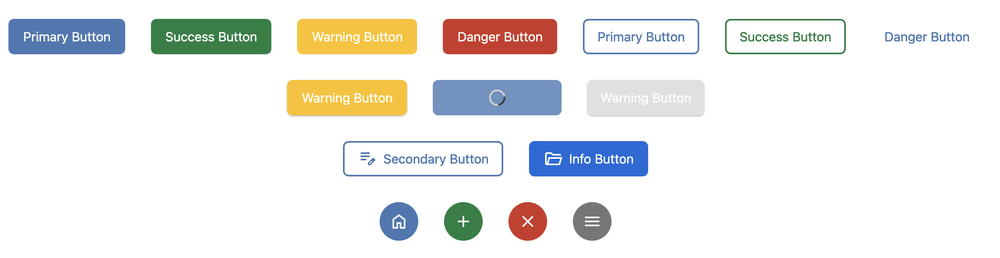
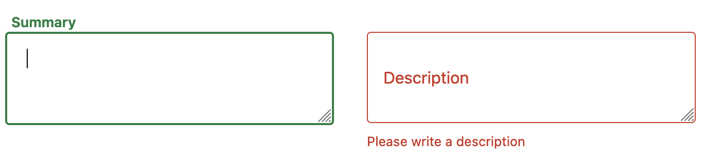
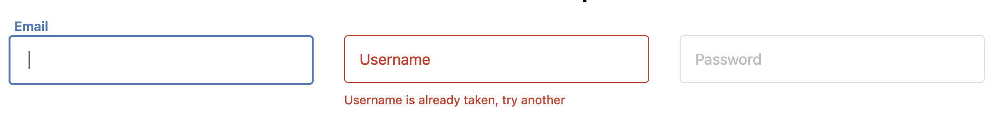
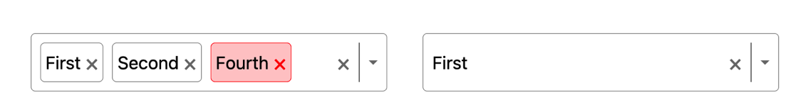
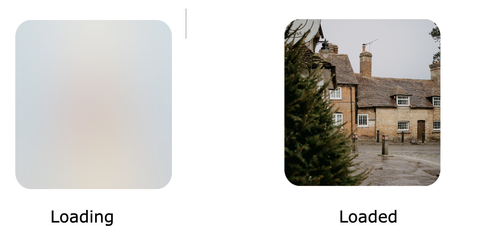

# Vault UI

# Table of Contents
1. [Installation](#installation)
2. [Buttons components](#buttonComponent)
3. [Input text components](#InputTextComponent)
4. [Select components](#SelectComponent)
5. [Lazy Load Image Component](#LazyLoadImageComponent)
6. [API references and Usage](#ApiUsageAndReferences)

## Installation 
```sh
 npm install @mohamedhemidi/vault-ui
```

## Buttons components
Simple buttons
```js
<Button color="primary">Primary Button</Button>
<Button color="success">Success Button</Button>
```
When using Icons it's highly recommended to use Google svg icons as they support re-coloring with fill attribute.
```js
 <Button
    icon={<EditIcon />}
    variant="outlined"
    size="small"
    color="primary"> Primary Outlined Button with Icon</Button>
```


## Input text components

Simple input texts
```js
<TextField label="Email" color="primary" type="text" name="username" />
<TextArea
    label="Summary"
    color="success"
    name="summary"
/>
```
Input with Error :
```js
<TextField
    label="Username"
    error
    errorMessage="Username is already taken, try another"
    color="primary"
    type="text"
    name="username"
/>
<TextArea
          label="Description"
          color="success"
          name="description"
          error
          errorMessage="Please write a description"
/>
```




## Select components


#### Example of usage: 
```js
const options = [
  { label: "First", value: 1 },
  { label: "Second", value: 2 },
  { label: "Third", value: 3 },
  { label: "Fourth", value: 4 },
  { label: "Fifth", value: 5 },
];
function App() {
    const [value1, setValue1] = useState<SelectOption[]>([options[0]]);
    const [value2, setValue2] = useState<SelectOption | undefined>(options[0]);
    
    return (
         <Select
          multiple
          options={options}
          value={value1}
          onChange={(o) => setValue1(o)}
        />
        
        <Select
          options={options}
          value={value2}
          onChange={(o) => setValue2(o)}
        />
    )
}
```

### Lazy Load Image Component



#### Example of usage: 
```js
<LazyLoadImage 
src={'your_image_path'} alt='alt text' borderRadius="2rem" />
```

## API References and Usage

### API references doc for the button component and usage
&nbsp;
| Name     | Type                                                                              | Default | Description                                                                                              |
|----------|-----------------------------------------------------------------------------------|---------|----------------------------------------------------------------------------------------------------------|
| children | node                                                                              | -       | The content of the button                                                                                |
| color    | \|"primary" \|"secondary" \|"info" \|"warning" \|"danger" \|"success" \|"neutral" | primary | The background color of the button                                                                       |
| size     | \|"small" \|"medium" \|"large"                                                    | small   | The size of the button                                                                                   |
| variant  | \|"outlined" \|"ghost" \|"filled" \|"shadow"                                      | filled  | The variant shape to use                                                                                 |
| rounded  | boolean                                                                           | false   | If true the button will be rounded  ⚠️ If true, the button accepts only **icons** and No text or children |
| disabled | boolean                                                                           | false   | If true button will be disabled                                                                          |
| loading  | boolean                                                                           | false   | If true a loading spinner shows and button will be disabled                                              |
| icon     | node                                                                              | -       | svg element placed at the beginning of the button , ⚠️ **Google icons are recomended**                    |
| width    | number                                                                            | auto    | Width size in **rem** unit                                                                               |
| height   | number                                                                            | auto    | Height size in **rem** unit                                                                              |


### API References for Text Field component
&nbsp;

| Name         | Type                                                                              | Default | Description                                   |
|--------------|-----------------------------------------------------------------------------------|---------|-----------------------------------------------|
| color        | \|"primary" \|"secondary" \|"info" \|"warning" \|"danger" \|"success" \|"neutral" | primary | The color of the input outline                |
| label        | text                                                                              | -       | The label text of the input                   |
| placeholder  | text                                                                              | -       | The placeholder text of the input             |
| error        | boolean                                                                           | false   | If true the borders and label get a red color |
| errorMessage | text                                                                              | -       | The error message in case of validation error |
| disabled     | boolean                                                                           | false   | If true button will be disabled               |
| width        | number                                                                            | auto    | Width size in **rem** unit                    |

### API References for Text Area component
&nbsp;

| Name         | Type                                                                              | Default | Description                                   |
|--------------|-----------------------------------------------------------------------------------|---------|-----------------------------------------------|
| color        | \|"primary" \|"secondary" \|"info" \|"warning" \|"danger" \|"success" \|"neutral" | primary | The color of the input outline                |
| label        | text                                                                              | -       | The label text of the input                   |
| placeholder  | text                                                                              | -       | The placeholder text of the input             |
| error        | boolean                                                                           | false   | If true the borders and label get a red color |
| errorMessage | text                                                                              | -       | The error message in case of validation error |
| disabled     | boolean                                                                           | false   | If true button will be disabled               |
| width        | number                                                                            | auto    | Width size in **rem** unit                    |


### API References for Select component
&nbsp;

| Name     | Type    | Default | Description                                                                 |
|----------|---------|---------|-----------------------------------------------------------------------------|
| multiple | boolean | false   | If true the select accept multi selection and                               |
| options* | array   | -       | An array of key value objects, ex : [{label: "Item 1", value: "items-one"}] |
| value*   | array   | -       | An array of key value Object , usually set in component state.              |

### API References for Lazy Load Image component
&nbsp;


| Name          | Type   | Default | Description                                                                                                                  |
|---------------|--------|---------|------------------------------------------------------------------------------------------------------------------------------|
| src           | string | -       | The path to the image                                                                                                        |
| alt           | string | -       | Alt text for SEO                                                                                                             |
| fallbackImage | string | -       | The path for the small size bitmap image that displays while loading, an auto base64 image is generated if this not provided |
| borderRadius  | string | 0       | The radius of the image in string with unit eg: "3rem" , "15px"                                                              |